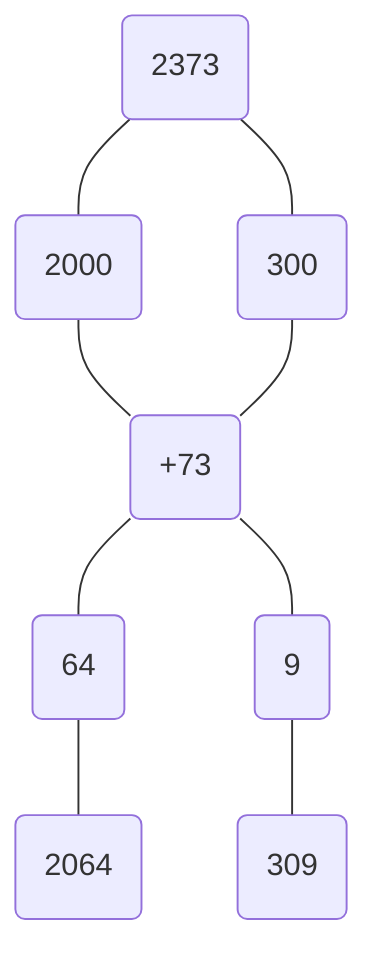

![[目录]]

<!DOCTYPE html>
<html>
<head>
    <title>Markdown目录生成器</title>
    
</head>
<body>
    

    
</body>
</html>

# 资料分析

|现期量|基期量|增长量|增长率|
|--|--|--|--|

## 主要考点
$$增长量 = \frac{现期}{1+增长率}\times增长率=\frac{现期}{1+\textcolor{red}{n}}$$

$$增长率 = \frac{增长量}{基期}=\frac{现期-基期}{基期}$$

$$现期 = 基期 \times (1+增长率)$$

$$基期 = \frac{现期}{(1+增长率)}=\frac{现期}{1+\frac{1}{\textcolor{red}{n}}}$$

$$(\textcolor{red}{n}为百分数化分数的分母)$$
## 其他考点
$$比重$$
$$倍数、比值$$

$$平均数=\frac{后面的词}{前面的词}$$
>- $单位面积产量=\frac{产量}{面积}$  
>- $人均GDP = \frac{GDP}{人}$
$$同比：上年同期$$ 
$$环比：上个同周期$$ 
$$百分点：加减法（易错）$$
$$成数：一成10\%$$
$$番数：翻n番为原来的2^n倍$$ 

## 截位直除法
$$\frac{1234~~~~}{234567}~~\frac{截位后小于1->0.}{对齐后分母多两位->\%}结果为0.5X\%$$

## 特数分数

|$\frac{1}{6}$|$\frac{1}{7}$|$\frac{1}{8}$|$\frac{1}{9}$|$\frac{1}{10}$|
|:--:|:--:|:--:|:--:|:--:|
|$16.7\%$|$14.3\%$|$12.5\%$|$11.1\%$|$10\%$|
|||分隔||||
|$\frac{1}{11}$|$\frac{1}{12}$|$\frac{1}{13}$|$\frac{1}{14}$|$\frac{1}{15}$|
|$9.1\%$|$8.3\%$|$7.7\%$|$7.1\%$|$6.7\%$|

## 化除为乘近似公式
$$\frac{A}{1-a\%}\approx A\times(1+a\%)~~(a\leqslant 5\%)$$

## 隔年增长率（笑脸公式）
$$隔年增长率=a\%+b\%+a\%\times b\%$$
$$a\%\times b\%：其中一个化为分数$$
$$| a\%|~\& ~|b\%|\leqslant 10\% ~时\Rightarrow a\% \times b\% 可省略$$
## 比重相关
$$A占B的比重，AB均为现期$$
$$基期比重 = \frac{A}{B}\times \frac{1+b}{1+a}$$
$$基现比重差 = \frac{A}{B}\times\frac{a-b}{1+a}$$
## 平均数增长率
$$平均每B的A，即A\div B，AB为现期$$
$$\frac{A}{B}的增长率=\frac{a-b}{1+b}$$
## 混合增长率
$$整体增长率介于两部分增长率之间$$
$$偏向基数较大一方$$
>词语合成：
>- 进+出口合成
>- 邮政+电信
>- 城+乡
>- 房+地产
>- 规模以上+规模以下
>- 限额以上+限额以下

>时间段合成：
>- 上半年+下半年
>- 1-11月+12月

## 算基期方法
$$\textcolor{red}{\frac{2373}{1+15.3\%}}$$
$$\textcolor{cyan}{分配法}$$
- [bilibili](https://www.bilibili.com/video/BV17m4y1D757/?spm_id_from=pageDriver&vd_source=420b13c7a95fdef281b725873da013e4)

|$\textcolor{#f58f98}{公式}$|||||
|:-:|:-:|:-:|:-:|:-:|
|$基期$|$+$|$基期\times15\%$|$=$|$现期$|
|$2000$|$+$|$300$|$=$|$2300$|
|$补58$|$+$|$补15$|$=$|$差73(一共补)$|
|||$即2000到2073之间$|||

$$\textcolor{cyan}{化“1”法}$$
$$\textcolor{#f58f98}{\frac{2373}{115}=\frac{2373-300^+(整体大于\frac{2}{1})}{115-15}=\frac{2073^-}{100}}$$

$$\textcolor{#f58f98}{\frac{2373}{115}=\frac{2373-310~~(23·1+2·4)}{115-15~~~~~~(11·1+1·4)}=\frac{2062}{100}}$$

$$ps：分母减少的量为增长量$$

$$\textcolor{red}{\frac{26857}{1+0.92\%}}$$
$$\textcolor{cyan}{除化乘}$$
$$\frac{26857}{1+0.92\%}=26857\times(1-0.92\%)$$
$$推倒：\frac{A}{1+r}=\frac{A(1-r)}{1+r^2}\approx A\times(1-r)$$
$$\textcolor{#f58f98}{公式：}基期=A-A\times r ~~(\textcolor{red}{r\leqslant 5\%})$$