[返回目录](新目录.md)

## 言语理解

<!DOCTYPE html>
<html>
<head>
    <title>Markdown目录生成器</title>
    
</head>
<body>
    

    
</body>
</html>

<!-- _class: cover_a trans -->
#### 目录
>  第一章 [片段阅读](#3) **(10题)**
中心理解题：重点词 ([转折](#4)[主题](#6)[因果](#7)[必要](#9)[程度](#10)[并列](#11)）
中心理解题：[行文脉络](#12)
>细节判断题：[细节判断](#13)

>  第二章 语句表达 **(10题)**
[语句排序题](#14) [语句填空题](#15) [接语选择题](#16)

> 第三章 逻辑填空题 **(20题)**
实词、成语、混搭填空题：[词的辩析](#17) [语境分析](#18) 

- 题量：40道 
- 做题时间：35分钟-40分钟左右 
- 正确率：70%-80%
#### 中心理解题
- **中心理解题**
    - 题量：10道左右
    - 提问方式：**旨在说明** 
- **解题顺序**
    - 看问题——带问题读文段——对应选项
- **解题思路**：寻找中心句
    - 有中心句：同义替换
    - 无中心句：全面概括
- **技巧**：重点词语、行文脉络、

#### 中心理解题 | 转折关系 | 上
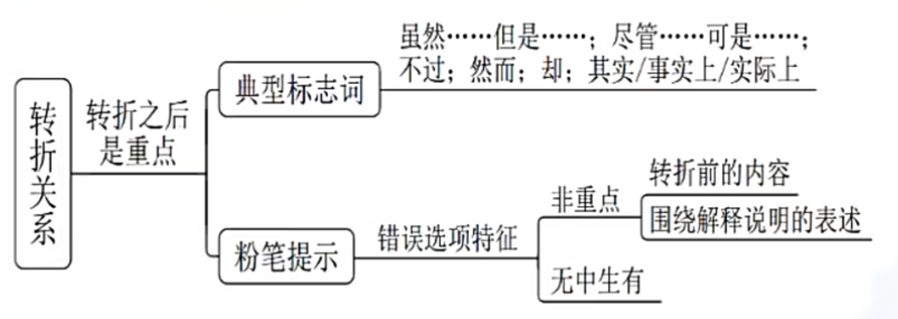

#### 中心理解题 | 转折关系 | 下
- **转折关系**——转折之后是重点
    - “虽然**但是**、尽管可是、不过、然而、却、其实、事实上、实际上、**必然要求**”
    - 解释说明中的转折非文段重点、引入举例中的转折非文段重点
    - 转折常考结构：
        - 1、引入 + 转折提出观点
        - 2、引入 + 转折提出观点 + 解释说明
        - 两个关键词出现，请把握行文脉络
    - **转折前**的内容有时也能判断

- 略读句子的特征
    - 例子：比如、例如、譬如、诸如
    - 原因：因为、由于
    - 背景：近年来、随着、在……背景下

#### 中心理解题 | 主题词
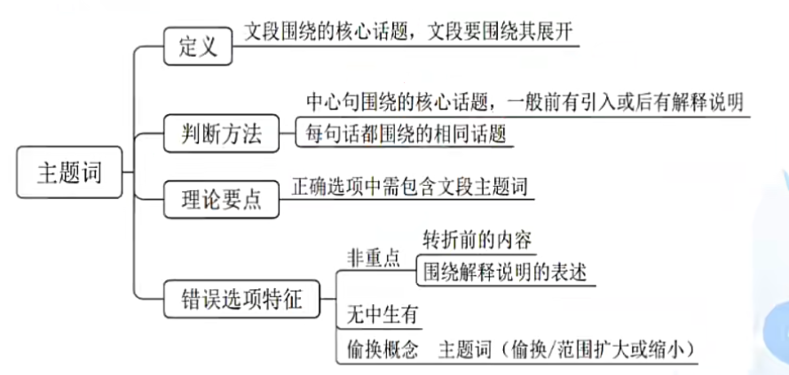

#### 中心理解题 | 因果关系 | 上

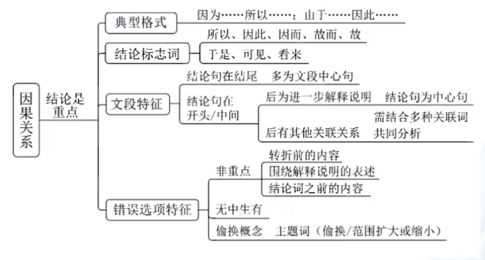

#### 中心理解题 | 因果关系 | 下
- 答案特征：
    - 正确答案特征：中心句同义替换
    - 错误答案特征：1、**转折前**的内容 2、围绕解释说明的表述 3、无中生有 4、与文意相悖
- **主题词**：定义：文段围绕的**核心话题**，文段围绕该主题词展开
    - 判断方法：(1) 中心句围绕核心话题，前有引入，后有解释说明 (2) 每句话都围绕相同话题——高频词
- **因果关系** ：
    - 所以 、因此、因耳、故而、故、于是、可见、看来
    - **结论**是重点
    - 若尾句出现结论词，通常尾句为中心句
- 拟人化：正确答案对中心句进行拟人、比喻等形象表达的同义替换
- pic: [错题](图片/因果关系错题01.png)
- 因果关系常用出题模板：
    - 文段结构：**结论** + **原因解释/原因分析** + **结论**
    - 正确选项设置：为什么、解释……的原因

#### 中心理解题 | 必要条件
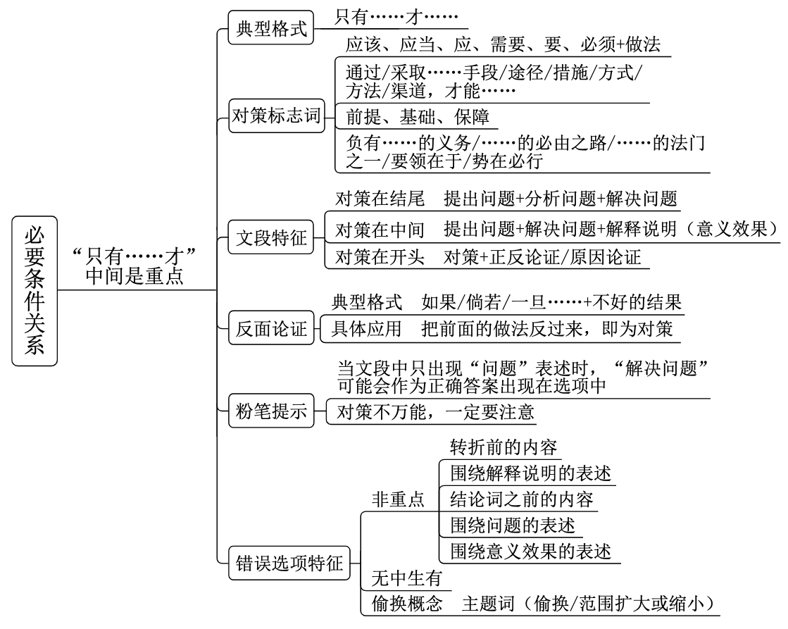

#### 中心理解题 | 程度词
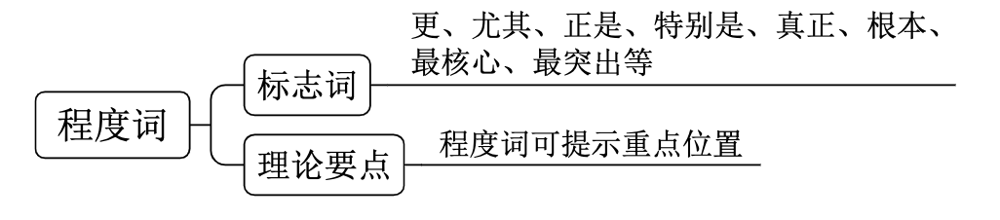
- 典型标志词：更、尤其、正是、特别是、真正、根本、最核心、最突出
- 非典型标志词：深为……倾倒、罪魁祸首、致命、堪比、极具特色

#### 中心理解题 | 并列关系
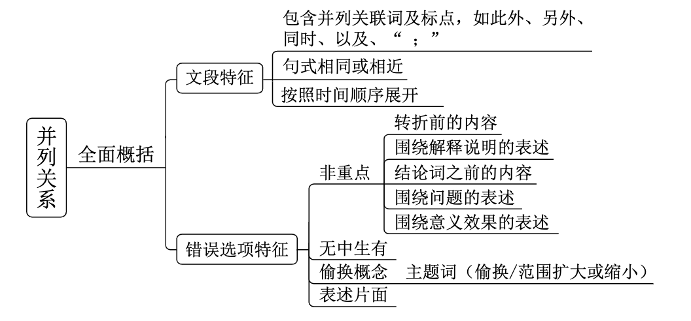

#### 中心理解题 | 行文脉络
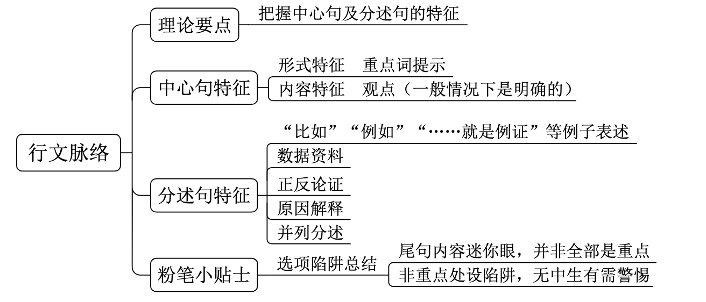

#### 细节判断题
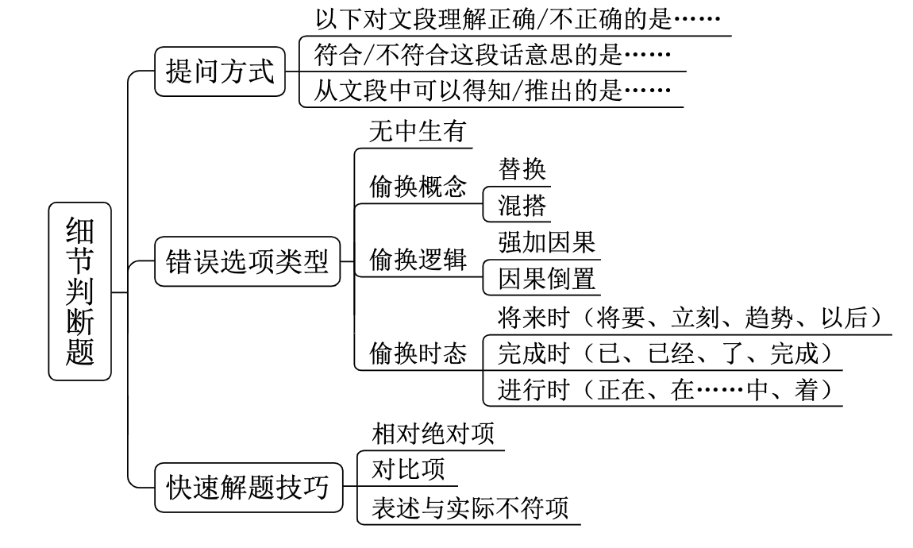

#### 语句排序题
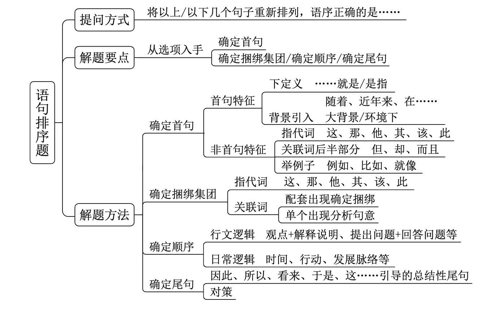

#### 语句填空题
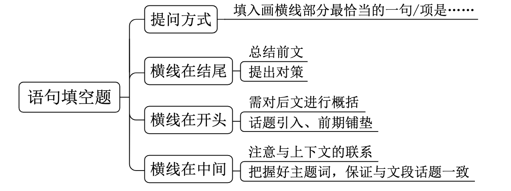

#### 接语选择题
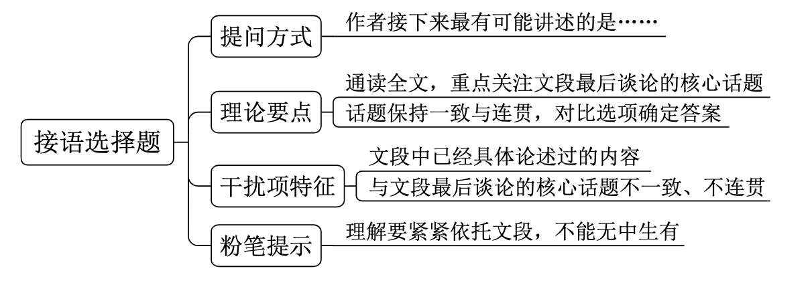

#### 逻辑填空题 | 词的辨析

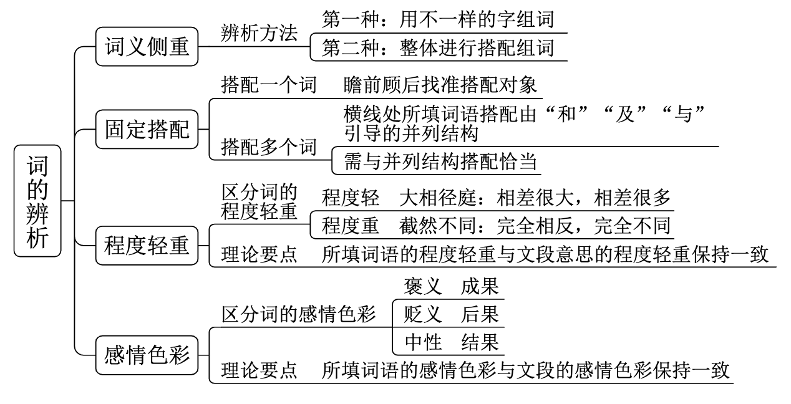
- 词语积累：微信小程序、粉笔快练

#### 逻辑填空题 | 语境分析
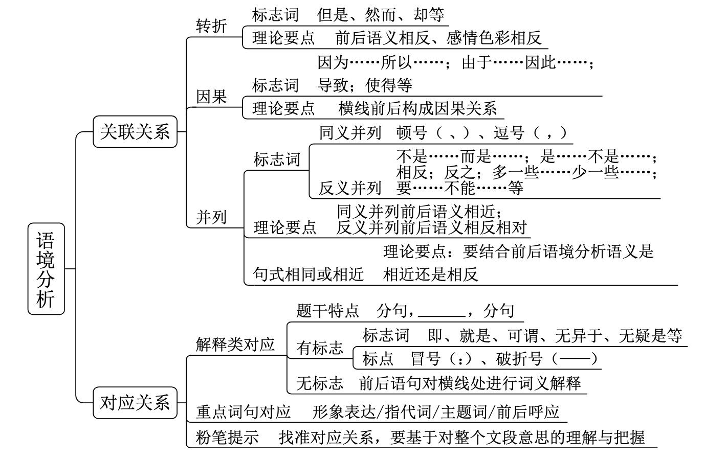